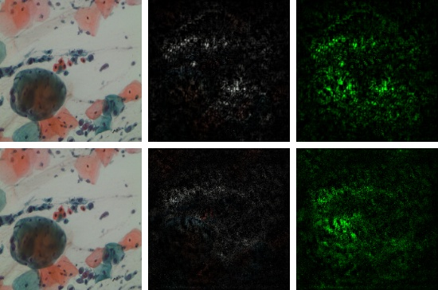
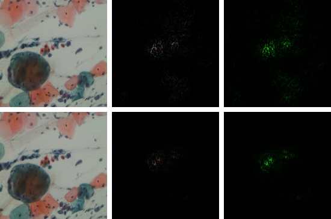

# Towards Interpretable Attention Networks for Cervical Cancer Analysis
Recent advances in deep learning have enabled the development of automated frameworks for analysing medical images and signals, including analysis of cervical cancer. Many previous works focus on the analysis of isolated cervical cells, or do not offer sufficient methods to explain and understand how the proposed models reach their classification decisions on multi-cell images. Here, we evaluate various state-of-the- art deep learning models and attention-based frameworks for the classification of images of multiple cervical cells. As we aim to provide interpretable deep learning models to address this task, we also compare their explainability through the visualization of their gradients. We demonstrate the importance of using images that contain multiple cells over using isolated single-cell images. We show the effectiveness of the residual channel attention model for extracting important features from a group of cells, and demonstrate this model’s efficiency for this classification task. This work highlights the benefits of channel attention mechanisms in analyzing multiple-cell images for potential relations and distributions within a group of cells. It also provides interpretable models to address the classification of cervical cells.

## Requirement
See [requirement.txt](./requirement.txt) for further details.

## Dataset
[SIPaKMeD](https://www.cs.uoi.gr/~marina/sipakmed.html) datasets is an open-source cervical cell image database. It consists of two different types of data: 966 multi-cell images and 4049 isolated cell images. There are five different categories of cervical cells in this dataset: superficial-intermediate, parabasal, koilocytotic, dysketarotic and metaplastic. 

  
  
  
  
  
   
  Multi-cells images in SIPaKMeD dataset

In this paper, we use the multi-cells images for main experiments. We also verified our models on isolated cell images and segmented region of multi-cells images. 

## Model
All models are in the folder `models`, which contains the baseline and all other methods used in this paper. 
- ResNet50 - baseline
- Residual Attention Network - model 1
- DenseNet121 - model 2
- DenseNet121 with Residual Channel Attention - model 3

### Results
Details of results are in [here](./Results.md) for further details.

The residual channel attention mechaism shows its effectiveness in the classification of multi-cells images.

  
   
  (a) DenseNet-121 without Attention
   
   
   
  
   
  (b) DenseNet-121 with Attention

## Reference
For the integrated gradient visualization: https://github.com/TianhongDai/integrated-gradient-pytorch

For the residual channel attention network: https://github.com/yulunzhang/RCAN

